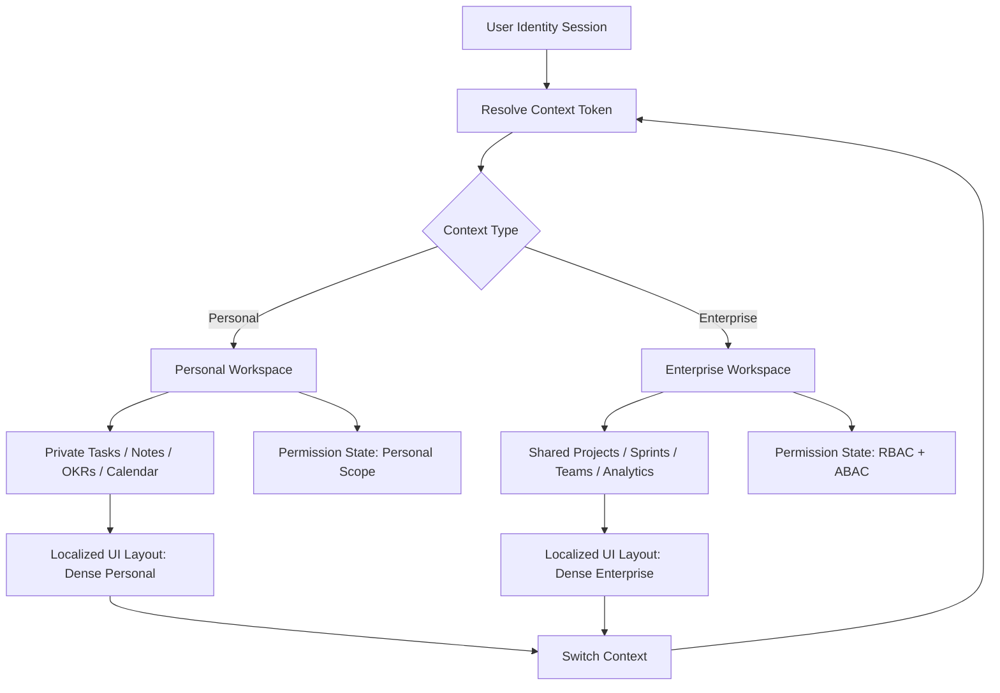

# Enterprise Project Management System (PMS)

## Vision
The Enterprise Project Management System is a unified, multi-context productivity platform designed to operate seamlessly across three distinct operating modes:

1. **Personal Workspace** for solo execution, private planning, note capture, and focused task management.
2. **Team Workspace** for collaborative planning, sprint execution, dependency tracking, and shared delivery visibility.
3. **Enterprise Control Plane** for governance, policy enforcement, compliance reporting, forecasting, and organizational-level portfolio management.

The platform is architected for zero-friction context switching between personal and enterprise perspectives while preserving strict security boundaries, data isolation, and operational performance at enterprise scale.

---

## 1. Product Architecture Blueprint

### 1.1 Core Architectural Pattern
The platform should be implemented as a **hybrid microservices + event-driven architecture** optimized for:

- **Ultra-low latency UI updates** via WebSockets and server-sent events.
- **Strong consistency for transactional workflows** using PostgreSQL as the authoritative system of record.
- **Event-driven integration** for analytics, notifications, compliance audit pipelines, and downstream automation.
- **Strict tenant and context isolation** using database partitioning, row-security controls, and service-layer authorization.

### 1.2 Recommended System Topology

```text
Client Layer
  ├─ Web App (React/Next.js)
  ├─ Mobile App (React Native or native shell)
  └─ CLI / API Integrations

API Gateway / Edge Layer
  ├─ Authentication & session orchestration
  ├─ Rate limiting / WAF / DDoS protection
  ├─ Request routing by tenant/context
  └─ WebSocket gateway

Application Services
  ├─ Identity & Access Service
  ├─ Workspace Service
  ├─ Project Service
  ├─ Task Service
  ├─ Resource Service
  ├─ Notification Service
  ├─ Analytics Service
  └─ Document/Knowledge Service

Data Layer
  ├─ PostgreSQL (primary transactional store)
  ├─ Redis (cache, ephemeral state, rate limits)
  ├─ Kafka / Event Hubs (event streaming)
  └─ Object storage (documents, attachments, exports)
```

### 1.3 High-Scale Infrastructure Principles

- **Stateless application services** for elasticity and rapid horizontal scaling.
- **Database sharding or logical partitioning** by tenant or business unit for large enterprise deployments.
- **Asynchronous processing** for audit trails, reporting, and integrations to avoid blocking user workflows.
- **Idempotent event processing** to guarantee replay safety during partial failures.
- **Service-level observability** using distributed tracing, OpenTelemetry, metrics, and structured logs.

### 1.4 Multi-Tenancy Strategy
The system must support enterprise-scale isolation using one of the following production-ready strategies:

| Strategy | Best For | Characteristics |
|---|---|---|
| **Schema-per-tenant** | Medium-to-large enterprises | Strong isolation, easier compliance boundaries, moderate operational overhead |
| **Database-per-tenant** | Large regulated organizations | Maximum isolation, high operational cost, strongest confidentiality model |
| **Partitioned shared database** | Very large SaaS deployments | Lower cost, strong governance with tenant_id and RLS, requires careful indexing and policy design |

**Recommended enterprise default:** a hybrid model using:
- **Shared application services**
- **Tenant-scoped PostgreSQL partitions**
- **Row Level Security (RLS)** for logical separation
- **Dedicated compliance partitions** for government/high-security tenants

### 1.5 Recommended Technology Stack

| Layer | Recommendation |
|---|---|
| Frontend | Next.js + React + TypeScript + Tailwind + motion-based UI primitives |
| Desktop/Web shell | Vercel-inspired dense workspace UI with keyboard-first navigation |
| API layer | Node.js (NestJS) or Go/Rust microservices |
| Real-time transport | WebSocket gateway, gRPC for internal service-to-service calls |
| Database | PostgreSQL 16+ with RLS, partitioning, logical replication |
| Cache | Redis for sessions, ephemeral task state, feature flags |
| Event streaming | Kafka or Azure Event Hubs |
| Storage | S3-compatible object storage or Azure Blob Storage |
| Identity | OIDC + SAML 2.0 + SCIM + hardware-backed MFA |
| Observability | OpenTelemetry, Prometheus, Grafana, Loki |

---

## 2. Dynamic Context Switching Model

### 2.1 Functional Paradigm
The platform supports a unified identity with instant context switching between:

- **Personal Account View**
  - Private tasks and checklists
  - Personal notes and journal entries
  - Personal OKRs and planning blocks
  - Time-blocking and private calendar coordination
  - Personal analytics and focus metrics

- **Team / Enterprise Workspace**
  - Shared projects and sprints
  - Portfolio and program management
  - Cross-team dependency tracking
  - RBAC/ABAC governed collaboration
  - Organizational reporting and governance dashboards

### 2.2 Context Switching Contract
When a user transitions contexts, the system must refresh the following state atomically:

- **Identity context**: current principal and subject claims
- **Workspace context**: tenant, team, project, and scope
- **Permission context**: effective roles, policy evaluation result, feature access
- **UI context**: navigation model, density, layout, and command palette scope
- **Data context**: visible object sets, filters, and data residency constraints

### 2.3 Runtime Context Model

```json
{
  "userId": "usr_01",
  "principal": {
    "identityProvider": "okta",
    "authMethod": "hardware_mfa"
  },
  "workspace": {
    "mode": "enterprise",
    "tenantId": "tenant_42",
    "teamId": "team_09",
    "projectId": "proj_1001"
  },
  "permissions": {
    "roles": ["manager", "planner"],
    "effectivePolicies": ["task.write", "report.read"]
  },
  "ui": {
    "layout": "dense-enterprise",
    "commandPalette": "org-wide",
    "visualContext": "corporate"
  }
}
```

---

## 3. Security, Compliance, and Governance

### 3.1 Authentication and Identity
The platform must support enterprise-grade identity integration:

- **OIDC** for modern user authentication.
- **SAML 2.0** for legacy enterprise identity providers.
- **SCIM 2.0** for provisioning and deprovisioning user accounts.
- **Hardware-backed MFA** using FIDO2/WebAuthn, smart cards, or YubiKey-style devices.
- **Conditional access** based on IP range, device posture, geolocation, and time-of-day.

### 3.2 Authorization Model
The platform should implement a layered authorization model:

- **RBAC** for coarse organizational roles such as Admin, Manager, Contributor, Viewer.
- **ABAC** for line-item and attribute-based access decisions such as:
  - region = EU
  - department = Finance
  - project classification = Restricted
  - customer = TopSecret

Example policy pattern:

```text
allow read on task where
  user.department == task.department
  AND user.clearance >= task.classification
  AND tenant.region == 'EU'
```

### 3.3 Security Controls

- **TLS 1.3** for all in-transit traffic.
- **AES-256** encryption at rest.
- **Customer-managed keys / BYOK** for regulated tenants.
- **Immutable audit logs** for all state changes, permission grants, exports, and role changes.
- **Secrets management** via Vault, Key Vault, or a managed secrets provider.
- **DDoS protection**, WAF, and API gateway policies.
- **Least privilege default** with just-in-time privilege elevation for privileged actions.

### 3.4 Compliance Readiness

| Standard | Required Capability |
|---|---|
| **SOC 2 Type II** | Evidence collection, immutable logs, access reviews, change management |
| **GDPR** | Data minimization, subject access requests, deletion workflows, localization controls |
| **HIPAA** | PHI segmentation, access controls, auditability, breach monitoring |
| **Governmental / Classified** | Sovereign storage, air-gapped or isolated deployment tiers, dual control approvals |

---

## 4. Data Architecture and Modeling

### 4.1 Core Domain Objects

#### Users
- `user_id`
- `tenant_id`
- `display_name`
- `email`
- `mfa_enabled`
- `status`
- `created_at`
- `last_login_at`

#### Tenants
- `tenant_id`
- `name`
- `region`
- `compliance_profile`
- `default_data_residency`
- `is_active`

#### Workspaces
- `workspace_id`
- `tenant_id`
- `workspace_type` (`personal`, `team`, `enterprise`)
- `display_name`
- `default_view`
- `visibility`

#### Projects
- `project_id`
- `tenant_id`
- `workspace_id`
- `name`
- `description`
- `status`
- `start_date`
- `end_date`
- `budget_cents`
- `owner_user_id`
- `classification_level`

#### Tasks
- `task_id`
- `tenant_id`
- `project_id`
- `parent_task_id`
- `title`
- `description`
- `status`
- `priority`
- `assignee_user_id`
- `reporter_user_id`
- `due_date`
- `estimated_hours`
- `actual_hours`
- `tags`
- `classification_level`

#### Dependencies
- `dependency_id`
- `source_task_id`
- `target_task_id`
- `dependency_type`
- `lag_days`

#### Time Entries
- `time_entry_id`
- `task_id`
- `user_id`
- `started_at`
- `ended_at`
- `billable`
- `cost_center`

#### Audit Events
- `audit_event_id`
- `tenant_id`
- `actor_id`
- `target_type`
- `target_id`
- `action`
- `before_state`
- `after_state`
- `created_at`

### 4.2 Database Design Recommendations

- Use PostgreSQL as the system of record.
- Partition large tables by `tenant_id` and date ranges for audit and analytics tables.
- Maintain separate indexes for search, filtering, and reporting workloads.
- Store large documents and attachments in object storage, not inside the transactional database.
- Keep immutable audit events append-only.

---

## 5. UX / UI Architecture

### 5.1 Design Principles
The UI should be optimized for **high-density, rapid cognition**, not decorative complexity.

- **Minimal visual noise** with strong information hierarchy.
- **Keyboard-first interaction** for power users.
- **Multi-layered command palette** for project switching, task creation, and navigation.
- **Contextual visual cues** to distinguish personal vs. enterprise data immediately.
- **Progressive disclosure** so advanced analytics are available but not intrusive.

### 5.2 Workspace Navigation Flow



### 5.3 UI Layout Model

| Surface | Personal View | Enterprise View |
|---|---|---|
| Navigation | Personal projects, notes, calendar | Portfolios, teams, programs, governance |
| Command Palette | Personal actions | Org-wide search and actions |
| Visual Identity | Soft personal tint | High-contrast corporate palette |
| Data Density | Focused, low-noise | Dense, analytics-first |

---

## 6. Functional Modules and Feature Breadth

### 6.1 Task and Project Tracking

| Capability | Personal | Enterprise |
|---|---|---|
| Task capture | Simple checklist and quick capture | Structured work item management |
| Kanban | Lightweight personal board | Cross-team sprint board |
| Gantt | Personal planning timeline | Program-level dependency scheduling |
| Dependencies | Optional | Critical path and cross-team mapping |
| Work item hierarchy | Basic | Epic → Story → Task → Subtask |

### 6.2 Resource and Capacity Management

- Real-time team bandwidth tracking.
- Time logging and cost attribution.
- Forecasting of delivery risk using velocity trends.
- Algorithmic resource allocation based on current load and skill tags.
- Budget and utilization dashboards for PMO structures.

### 6.3 Reporting and Analytics

| Scope | Personal | Enterprise |
|---|---|---|
| Insights | Focus time, completed tasks, productivity trends | Portfolio health, team velocity, capacity risk |
| Dashboards | Simple | Executive BI with drill-down |
| Forecasting | Basic trend lines | Predictive delivery and budget modeling |

---

## 7. Workflow Specifications

### 7.1 Task Lifecycle
1. Create task with title, description, priority, and classification.
2. Assign owner and due date.
3. Attach dependencies and estimation.
4. Move through workflow states: Backlog → Planned → In Progress → Review → Done.
5. Capture time entries and update delivery metrics.
6. Emit audit event and analytics event on each state transition.

### 7.2 Project Lifecycle
1. Create project with metadata, owner, budget, and compliance class.
2. Link related teams and resource plans.
3. Create milestones and dependencies.
4. Monitor progress and forecast delivery risk.
5. Close project with archive and retention policy enforcement.

### 7.3 Approval Workflow
- Change requests require approval based on budget or impact thresholds.
- Sensitive tasks require dual approval in regulated tenants.
- Approval actions produce immutable audit records.

---

## 8. Integration and Extensibility

The PMS should expose:

- **REST APIs** for CRUD and search operations.
- **WebSocket APIs** for live board and activity updates.
- **gRPC interfaces** for internal service orchestration.
- **Webhook support** for CI/CD, ticketing, and ERP platforms.
- **Event-driven connectors** to Slack, Teams, Jira, GitHub, Azure DevOps, SAP, and finance systems.

---

## 9. Operational Excellence

### 9.1 Reliability
- Multi-region deployment where required.
- Automatic failover with service health checks.
- Circuit breakers and idempotent retries for downstream integrations.

### 9.2 Observability
- Trace user actions from client to database.
- Capture latency, queue depth, and failure rate at every service boundary.
- Alert on permission anomalies, unusual task churn, or data residency violations.

### 9.3 Deployment Model
- Kubernetes or managed container orchestration for services.
- Infrastructure as Code using Terraform or Bicep.
- Blue/green or canary deployment strategy for safe releases.

---

## 10. Implementation Roadmap

### Phase 1 — Core Foundation
- Identity and workspace model
- Project/task CRUD
- Basic RBAC
- Personal and enterprise workspace shells

### Phase 2 — Collaboration and Governance
- Shared boards
- Dependencies and approval flows
- Audit logging
- SCIM / SAML integration

### Phase 3 — Scale and Intelligence
- Real-time collaboration
- Analytics engine
- Capacity forecasting
- Cost and utilization modeling

### Phase 4 — Regulated Enterprise Readiness
- BYOK and sovereign storage
- Advanced ABAC
- Compliance automation
- Executive reporting

---

## 11. Success Criteria
A production deployment is considered enterprise-ready when it provides:

- Smooth context switching between personal and enterprise workspaces
- Strong tenant isolation and compliance controls
- Predictable performance under heavy concurrent usage
- Full auditability of all critical operations
- Secure, role-aware collaboration at scale

---

## 12. Summary
This platform is not merely a task board. It is a **context-aware operating system for work**, combining personal productivity, team execution, and enterprise governance in a single secure environment. Its architecture is designed to scale from the individual user to global organizations while preserving privacy, control, and operational discipline.
